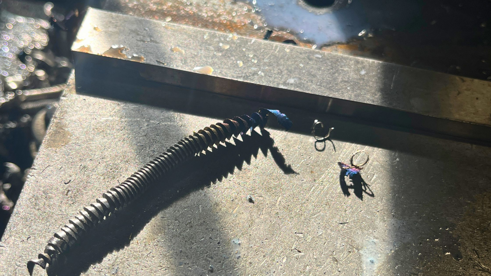
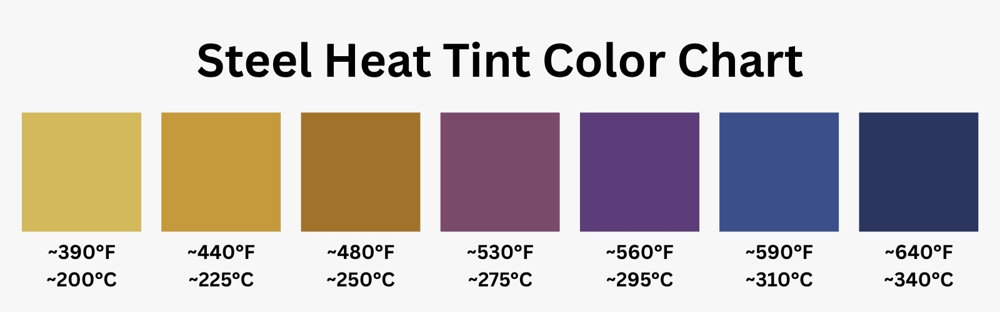

I was drilling through some 1018 steel plates the other day and pulled out a chip that looked like a tiny metallic rainbow — silver at one end, gold in the middle, and dark blue at the tip. If you've ever cut, welded, or ground steel, you've probably seen this. But what's actually happening?

## The Short Answer

When steel gets hot, a thin layer of oxide forms on the surface. The hotter it gets, the thicker the layer. And the thickness of that layer determines the color you see.

The steel itself isn't changing color. A nearly invisible film is forming on top of it, and that film plays tricks with light.

## What Temperature Does Steel Turn Blue?

For plain carbon steel (like 1018), the color progression looks roughly like this:

| Color | Temperature (°F) | Temperature (°C) |
|---|---|---|
| Light straw | ~390°F | ~200°C |
| Dark straw | ~440°F | ~225°C |
| Gold / Brown | ~480°F | ~250°C |
| Purple | ~530°F | ~275°C |
| Blue | ~590°F | ~310°C |
| Dark blue | ~640°F | ~340°C |

These are approximations. The exact temperatures change depending on alloy composition, surface finish, and how long the steel is exposed to heat. But the color sequence is consistent.

If you've ever seen a long, curly chip come off a drill or lathe, you can sometimes see the entire gradient in one piece. The tip that was in contact with the cutting edge got the hottest, so it turns blue. The color fades back through purple and gold as you move toward the cooler end.

## Why Blue? Thin-Film Interference

Here's where it gets interesting. The oxide layer isn't blue. It's mostly transparent. The color comes from the same physics that make soap bubbles iridescent and oil slicks rainbow-colored.

When light hits the oxide layer, some of it reflects off the top surface and some passes through and reflects off the steel underneath. Those two reflected beams travel slightly different distances, and when they recombine, certain wavelengths reinforce each other while others cancel out.

At the thickness that forms around 590°F, the geometry happens to reinforce blue wavelengths. A thinner layer (lower temperature) reinforces yellow. A bit thicker and you get purple. It's called thin-film interference, and it's the same phenomenon everywhere you see color coming from a transparent layer — butterfly wings, anti-reflective coatings on camera lenses, even the rainbow sheen on a puddle in a parking lot.

The oxide doing the work here is primarily magnetite (Fe₃O₄), which forms when iron reacts with oxygen at elevated temperatures.

## Wait — Isn't Rust Also Oxidation?

Yes. And this is one of the most interesting parts.

[Rust is iron oxide too](/posts/what-is-rust-on-steel-made-of/) — specifically iron(III) oxide, or Fe₂O₃. It forms when steel is exposed to oxygen and moisture over time, at room temperature. And it's always that familiar red-orange-brown color.

Heat tint oxide (Fe₃O₄) forms when steel reacts with oxygen at high temperature, without moisture. It produces a thin, mostly transparent layer that gets its color from interference, not from the compound itself.

So both are "steel + oxygen," but:

- **Rust (Fe₂O₃):** Needs moisture. Forms slowly. The compound itself is orange-brown. Color comes from the chemistry.
- **Heat tint (Fe₃O₄):** Needs heat. Forms in seconds. The layer is transparent. Color comes from the physics of light interference.

There's a practical difference too. Rust eats into the metal and keeps spreading. Heat tint just sits on the surface. Which brings up the next question.

## Can You Remove Heat Tint?

Yes, because it's just a surface layer measured in microns.

A Scotch-Brite pad, fine sandpaper, a wire wheel, or any light abrasive will take it right off. For stainless steel welds, fabricators often use pickling paste (an acid-based treatment) to chemically dissolve the heat tint layer because it restores the corrosion resistance that the oxide film compromises.

The fact that you can buff it off is actually a good way to understand the difference between heat tint and rust. Try buffing rust off a piece of steel that's been sitting outside for a year — you'll find pits and material loss underneath. If you buff heat tint off a drill chip, the steel underneath looks brand new.

## Do Different Steel Alloys Turn Blue at Different Temperatures?

Yes, and this is where the "standard" color chart starts to break down.

The color-temperature relationship changes based on alloy composition, particularly chromium content. Chromium resists oxidation, which means the oxide layer forms more slowly on alloys with more of it.

For mild or carbon steel (like 1018, 1045, or 4140), the color chart above is a reasonable reference. But stainless steel behaves differently. On stainless, color changes start around 550°F for a pale yellow and don't reach dark blue until around 1,100°F — a significantly wider range than carbon steel.

Within the stainless family, the differences continue. A 304 stainless will tint at different rates than a 316, because 316 has different chromium and nickel content. And high-chromium alloys like Incoloy resist tinting even further.

This is why there's no single universal heat tint color chart. Published charts are usually specific to a particular alloy tested under controlled conditions. They're useful as a general reference, but not precise enough to use as a thermometer.

The one exception: once you get above roughly 800°F, steel starts to glow. Those incandescent colors — dark red, cherry red, orange, yellow, white — are driven by black-body radiation, which is purely temperature-dependent. A piece of 1018 and a piece of 316 stainless will both glow cherry red at the same temperature. It's only the lower-temperature oxide colors that vary by alloy.

## Does Heat Tint Affect the Steel?

On the workpiece, heat tint is almost entirely cosmetic. The oxide layer is extremely thin and doesn't change the mechanical properties of the steel underneath. If appearance matters, you can remove it. If it doesn't, you can ignore it.

On cutting tools, it's a different story. If you're seeing heavy blue on your drill bits or end mills, it means the cutting edge is getting hot — and repeated overheating will soften high-speed steel (HSS) tooling over time. Carbide tools handle heat better, but even they have limits.

If you're consistently producing blue chips, consider slowing your speed, reducing your feed rate, or adding cutting fluid. The chips will still be warm, but keeping temperatures down extends tool life and usually gives you a cleaner cut.

## The Bottom Line

Steel turns blue when heated because a thin oxide layer forms on the surface and interferes with light — reflecting blue wavelengths back to your eye at around 590°F. It's the same physics behind soap bubbles and oil slicks, just happening on metal instead of film.

It's also a reminder that "oxidation" covers a lot of ground. The same iron reacting with oxygen produces completely different results depending on whether moisture or heat is doing the driving. One gives you rust. The other gives you a rainbow on a drill chip.
